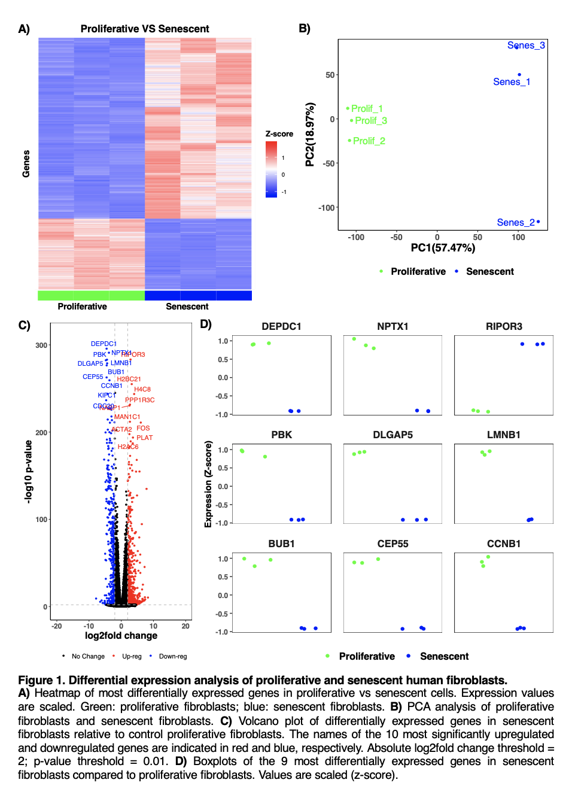

# Bulk RNA-seq analyses in R

The code parses the files and produces the following plots and analyses:
- Volcano plot 
- MA plot 
- PCA 
- Heatmap 
- Faceted boxplots 
- Pathway analysis

  
## Table of contents: 
- Parsing function
- save.png function
- save.emf function
- Volcano plot function
- MA plot function
- PCA function
- Heatmap function
- Faceted boxplots function
- Pathway analysis function 

## Required files: 
4 files 
  - **em**: a normalised expression matrix
  - **de**: differential expression statistics between each sample group of interest 
  - **annotation**: genome annotation
  - **ss**: sample group information. 

## Required installation of the following R libraries: 
`library(ggplot2)`

`library(reshape2)`

`library(ggrepel)`

`library(tidyverse)`

`library(amap)`

`library(devEMF)`

`library(clusterProfiler)` 

`library(org.Hs.eg.db)`

`library(enrichplot)`

`library(GOSemSim)`

`library(DOSE)`
